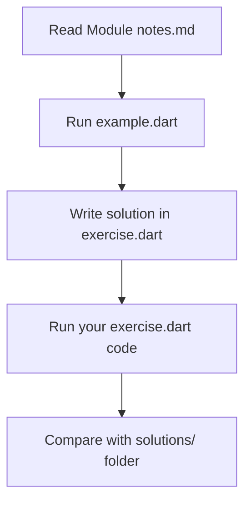

# Learn Dart Programming: Step-by-Step

Created by **Daniyal Ahsan**

Welcome to the Dart Learning Repository! This repository is a self-paced, structured hands-on tutorial designed to take you from a complete beginner to writing clean, idiomatic Dart programs.

Dart is a client-optimized language developed by Google, famous for powering **Flutter** (for building beautiful cross-platform mobile, web, and desktop apps) and highly performant backend frameworks like **Shelf** or **Dart Frog**.

---

## Curriculum Roadmap

The course is organized into sequential modules. Each module covers a core concept of the Dart language.

| Module | Topic | Core Focus | Files |
| :--- | :--- | :--- | :--- |
| **01** | [Introduction to Dart](./01-intro/) | Dart Overview, SDK Installation, `main()` entrypoint | `notes.md` |
| **02** | [Input & Output Basics](./02-io-basics/) | Using `print()`, standard input via `stdin.readLineSync()`, Null Safety intro | `notes.md`, `example.dart`, `exercise.dart` |
| **03** | [Variables & Keywords](./03-variables-keywords/) | Mutable and immutable declarations with `var`, `final`, `const`, and `dynamic` | `notes.md`, `example.dart`, `exercise.dart` |
| **04** | [Data Types](./04-data-types/) | Working with `int`, `double`, `String`, `bool`, `List`, and `Map` collections | `notes.md`, `example.dart`, `exercise.dart` |
| **05** | [Operators](./05-operators/) | Arithmetic, Comparison, Logical, and Assignment operators | `notes.md`, `example.dart`, `exercise.dart` |
| **06** | [Control Flow](./06-control-flow/) | Conditional branching (`if-else`, `switch`) and loops (`for`, `while`, `do-while`) | `notes.md`, `example.dart`, `exercise.dart` |
| **07** | [Functions](./07-functions/) | Functions, arrow functions, named and optional parameters, string interpolation | `notes.md`, `example.dart`, `exercise.dart` |
| **08** | [Null Safety](./08-null-safety/) | Nullable and non-nullable types, null assertions (`!`), null-aware operators (`??`, `??=`), `late` variables | `notes.md`, `example.dart`, `exercise.dart` |
| **09** | [Collections](./09-collections/) | Working with lists, sets, and maps, common collection methods, key-value structures, and loops | `notes.md`, `example.dart`, `exercise.dart` |
| **10** | [OOP: Classes & Objects](./10-oop-classes/) | Object-Oriented Programming basics including classes, objects, default/named constructors, and methods | `notes.md`, `example.dart`, `exercise.dart` |
| **11** | [Inheritance, Interfaces & Mixins](./11-inheritance-interfaces-mixins/) | OOP inheritance, abstract classes, interfaces (`implements`), mixins (`with`), and method overriding | `notes.md`, `example.dart`, `exercise.dart` |
| **12** | [Exceptions & Generics](./12-exceptions-generics/) | Exception handling (`try-catch`, custom exceptions) and generic programming basics | `notes.md`, `example.dart`, `exercise.dart` |
| **13** | [Asynchronous Programming](./13-async-await-future/) | Asynchronous Dart, async, await, Futures, error handling, parallel execution | `notes.md`, `example.dart`, `exercise.dart` |
| **13b** | [Streams & Async Error Handling](./13b-streams-async-errors/) | Asynchronous streams, async*, yield, stream listening (await for, .listen), stream operations, async error handling | `notes.md`, `example.dart`, `exercise.dart` |

---

## Practical Mini-Projects

Once you have mastered the core language features, put your skills to the test with these console mini-projects located in the [practical/](./practical/) directory:

- **CLI Calculator** ([calculator.dart](./practical/calculator.dart)): A command-line calculator that takes user inputs, processes arithmetic operators (+, -, *, /), and includes zero-division safety.
- **Multi-Unit Temperature Converter** ([temperature-convertor.dart](./practical/temperature-convertor.dart)): A robust CLI tool that converts temperatures across Celsius, Fahrenheit, and Kelvin through a user-friendly selection menu.
- **Text-Based Quiz App** ([text-based-quiz-app.dart](./practical/text-based-quiz-app.dart)): An interactive quiz game that prompts the user with questions, validates responses, updates scores, and provides performance feedback.
- **Contact Manager** ([contact_manager.dart](./practical/contact_manager.dart)): An object-oriented CLI system managing contact creation, deletion, search, and list, incorporating custom exception handling.
- **Weather App** ([main.dart](./practical/Weather_App/main.dart)): A console app that fetches live weather data from the Open-Meteo API using async/await, HTTP requests, and JSON parsing.

To run the practical projects, run the following commands in your terminal:

```bash
dart run practical/calculator.dart
dart run practical/temperature-convertor.dart
dart run practical/text-based-quiz-app.dart
dart run practical/contact_manager.dart
dart run practical/Weather_App/main.dart
```

---

## Logic Building & Recursion

To strengthen your problem-solving abilities and understand execution flow, try these exercises located in the [logic-building/](./logic-building/) directory (see the full [Problem Set](./logic-building/statements.md)). They cover fundamental algorithms using both iterative and recursive approaches:

- **Sorting Algorithms**:
  - **Bubble Sort** ([bubble-sort.dart](./logic-building/bubble-sort.dart))
  - **Merge Sort** ([merge-sort.dart](./logic-building/merge-sort.dart))
- **Search Algorithms**:
  - **Linear Search** ([linear-search.dart](./logic-building/linear-search.dart))
  - **Binary Search** ([binary-search.dart](./logic-building/binary-search.dart))
- **Standard Logic**:
  - **FizzBuzz** ([fizzbuzz.dart](./logic-building/fizzbuzz.dart))
  - **Palindrome Check** ([plaindrome.dart](./logic-building/plaindrome.dart))
  - **Reverse Number** ([reverse-number.dart](./logic-building/reverse-number.dart))
- **Iteration vs. Recursion**:
  - **Factorial** ([factorial.dart](./logic-building/factorial.dart) & [factorial-recursive.dart](./logic-building/factorial-recursive.dart))
  - **Fibonacci** ([fibonacci.dart](./logic-building/fibonacci.dart) & [fibonacci-recursive.dart](./logic-building/fibonacci-recursive.dart))
  - **Sum of 1 to N** ([sum-of-1-to-N.dart](./logic-building/sum-of-1-to-N.dart) & [sum-of-1-to-N-recursive.dart](./logic-building/sum-of-1-to-N-recursive.dart))
- **Recursive Thinking**:
  - **Recursive Countdown** ([recursive-countdown.dart](./logic-building/recursive-countdown.dart))
  - **Digit Counter** ([digit-counter-recursive.dart](./logic-building/digit-counter-recursive.dart))
  - **Power Calculator** ([recursive-power-calculator.dart](./logic-building/recursive-power-calculator.dart))
- **Arrays & Lists**:
  - **Find Maximum** ([find_maximum.dart](./logic-building/find_maximum.dart))
  - **Find Minimum** ([find_minimum.dart](./logic-building/find_minimum.dart))
  - **Sum of Elements** ([sum_of_elements.dart](./logic-building/sum_of_elements.dart))
  - **Even and Odd Counter** ([count_even_odd.dart](./logic-building/count_even_odd.dart))
  - **Remove Duplicates** ([remove_duplicates.dart](./logic-building/remove_duplicates.dart))
  - **Reverse List Manually** ([reverse_list.dart](./logic-building/reverse_list.dart))
- **String Manipulation**:
  - **Count Vowels** ([count_vowels.dart](./logic-building/count_vowels.dart))
  - **Count Word Occurrences** ([count_word_occurrences.dart](./logic-building/count_word_occurrences.dart))
  - **Capitalize Each Word** ([capitalize_words.dart](./logic-building/capitalize_words.dart))
  - **Find Longest Word** ([find_longest_word.dart](./logic-building/find_longest_word.dart))
- **Hash Maps (Dart `Map`)**:
  - **Character Frequency** ([character_frequency.dart](./logic-building/character_frequency.dart))
  - **Word Frequency** ([word_frequency.dart](./logic-building/word_frequency.dart))
  - **First Non-Repeating Character** ([first_non_repeating_character.dart](./logic-building/first_non_repeating_character.dart))
  - **Group Even and Odd** ([group_by_even_odd.dart](./logic-building/group_by_even_odd.dart))

To run a logic-building script, use:

```bash
dart run logic-building/<filename>.dart
```

---

## Getting Started

Follow these steps to set up your local development environment:

1. **Install Dart SDK**:
   - Download and install the Dart SDK from the [Official Dart website](https://dart.dev/get-dart).
   - Alternatively, install [Flutter](https://flutter.dev/docs/get-started/install), which comes pre-bundled with the Dart SDK.
2. **Set Up VS Code**:
   - Install [Visual Studio Code](https://code.visualstudio.com/).
   - Open the VS Code Extensions tab (`Ctrl+Shift+X` or `Cmd+Shift+X`) and install the **Dart** extension.
3. **Clone this Repository**:

   ```bash
   git clone <repository-url>
   cd dart-learning
   ```

---

## Guided Learning Workflow

To get the most out of this repository, follow this learning loop for each module:



1. **Read `notes.md`**: Study the concepts, vocabulary, syntax rules, and cheat sheets in the directory.
2. **Analyze `example.dart`**: Run the example code using the terminal to see how the syntax behaves.

   ```bash
   dart run <module-folder>/example.dart
   ```

3. **Practice**: Open `exercise.dart` (which is kept blank for you) and write a program that satisfies the exercise instructions found at the bottom of that module's `notes.md`.
4. **Test**: Run your custom exercise code:

   ```bash
   dart run <module-folder>/exercise.dart
   ```

5. **Review**: Check your answers against the corresponding file in the [solutions/](./solutions/) directory to see how it can be structured.

---

## Key Tips & Conventions

- **Naming Conventions**: Variables and functions in Dart should use `camelCase` (e.g., `favoriteFood`, `userAge`).
- **Null Safety**: When reading input with `stdin.readLineSync()`, Dart returns a nullable String (`String?`). Keep this in mind when defining variable types.
- **Run Anywhere**: Since Dart compiles to standalone machine code or JavaScript, the skills you learn here translate directly to writing backend APIs, command-line utilities, or Flutter apps.

---
## Frequently Asked Questions (FAQ)

### Why should I learn Dart before Flutter?
Dart is the foundational programming language that powers Flutter. Mastering core Dart concepts—like null safety, control flow, and collections—prevents common errors and makes building cross-platform mobile and web interfaces in Flutter significantly easier.

### What is the difference between `var`, `final`, and `const` in Dart?
- `var` is used when you want Dart to infer the variable type, and the value can be changed.
- `final` is used for variables whose values are set only once at runtime (e.g., fetching data from an API). 
- `const` is used for variables whose values are completely fixed and known at compile-time (e.g., hardcoded UI values). 

### How does Null Safety work in Dart?
Null safety ensures that variables cannot contain a `null` value unless you explicitly allow them to by adding a question mark (e.g., `String?`). This feature eliminates a massive class of runtime errors, making your Flutter apps much more stable.

### Do I need prior programming experience to use this repository?
No prior experience is strictly required, though familiarity with basic programming concepts helps. This curriculum is structured step-by-step, starting from basic SDK installation and I/O, moving up to functions and null safety, complete with hands-on `exercise.dart` files to practice.

### Can I build backend APIs with Dart?
Yes! While Dart is famous for Flutter mobile and web apps, it compiles to standalone machine code. You can use frameworks like Shelf or Dart Frog to write highly performant backend servers and command-line utilities.

*Happy Coding! If you find this repository helpful, consider leaving a star!*
