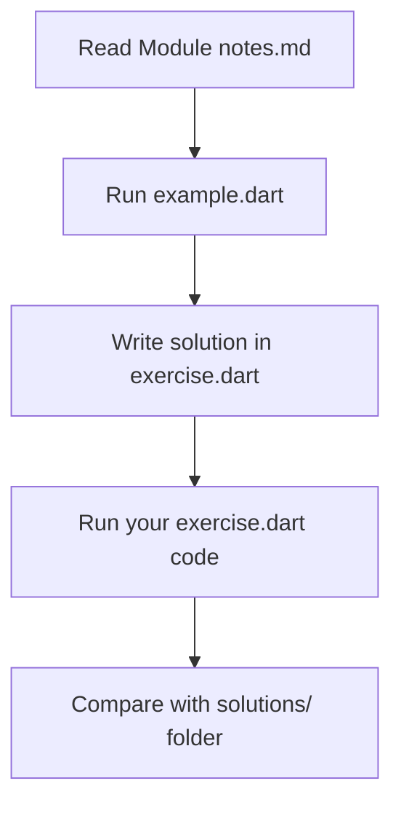

# Learn Dart Programming: Step-by-Step

Created by **Daniyal Ahsan**

Welcome to the Dart Learning Repository! This repository is a self-paced, structured hands-on tutorial designed to take you from a complete beginner to writing clean, idiomatic Dart programs.

Dart is a client-optimized language developed by Google, famous for powering **Flutter** (for building beautiful cross-platform mobile, web, and desktop apps) and highly performant backend frameworks like **Shelf** or **Dart Frog**.

---

## Curriculum Roadmap

The course is organized into sequential modules. Each module covers a core concept of the Dart language.

| Module | Topic | Core Focus | Files |
| :--- | :--- | :--- | :--- |
| **01** | [Introduction to Dart](./01-intro/) | Dart Overview, SDK Installation, `main()` entrypoint | `notes.md` |
| **02** | [Input & Output Basics](./02-io-basics/) | Using `print()`, standard input via `stdin.readLineSync()`, Null Safety intro | `notes.md`, `example.dart`, `exercise.dart` |
| **03** | [Variables & Keywords](./03-variables-keywords/) | Mutable and immutable declarations with `var`, `final`, `const`, and `dynamic` | `notes.md`, `example.dart`, `exercise.dart` |
| **04** | [Data Types](./04-data-types/) | Working with `int`, `double`, `String`, `bool`, `List`, and `Map` collections | `notes.md`, `example.dart`, `exercise.dart` |
| **05** | [Operators](./05-operators/) | Arithmetic, Comparison, Logical, and Assignment operators | `notes.md`, `example.dart`, `exercise.dart` |
| **06** | [Control Flow](./06-control-flow/) | Conditional branching (`if-else`, `switch`) and loops (`for`, `while`, `do-while`) | `notes.md`, `example.dart`, `exercise.dart` |

---

## Getting Started

Follow these steps to set up your local development environment:

1. **Install Dart SDK**:
   - Download and install the Dart SDK from the [Official Dart website](https://dart.dev/get-dart).
   - Alternatively, install [Flutter](https://flutter.dev/docs/get-started/install), which comes pre-bundled with the Dart SDK.
2. **Set Up VS Code**:
   - Install [Visual Studio Code](https://code.visualstudio.com/).
   - Open the VS Code Extensions tab (`Ctrl+Shift+X` or `Cmd+Shift+X`) and install the **Dart** extension.
3. **Clone this Repository**:

```bash
   git clone <repository-url>
   cd dart-learning
   ```

---

## Guided Learning Workflow

To get the most out of this repository, follow this learning loop for each module:



1. **Read `notes.md`**: Study the concepts, vocabulary, syntax rules, and cheat sheets in the directory.
2. **Analyze `example.dart`**: Run the example code using the terminal to see how the syntax behaves.

```bash
   dart run <module-folder>/example.dart
   ```

1. **Practice**: Open `exercise.dart` (which is kept blank for you) and write a program that satisfies the exercise instructions found at the bottom of that module's `notes.md`.
2. **Test**: Run your custom exercise code:

   ```bash
   dart run <module-folder>/exercise.dart
   ```

3. **Review**: Check your answers against the corresponding file in the [solutions/](./solutions/) directory to see how it can be structured.

---

## Key Tips & Conventions

- **Naming Conventions**: Variables and functions in Dart should use `camelCase` (e.g., `favoriteFood`, `userAge`).
- **Null Safety**: When reading input with `stdin.readLineSync()`, Dart returns a nullable String (`String?`). Keep this in mind when defining variable types.
- **Run Anywhere**: Since Dart compiles to standalone machine code or JavaScript, the skills you learn here translate directly to writing backend APIs, command-line utilities, or Flutter apps.

---

*Happy Coding! If you find this repository helpful, consider leaving a star!*
