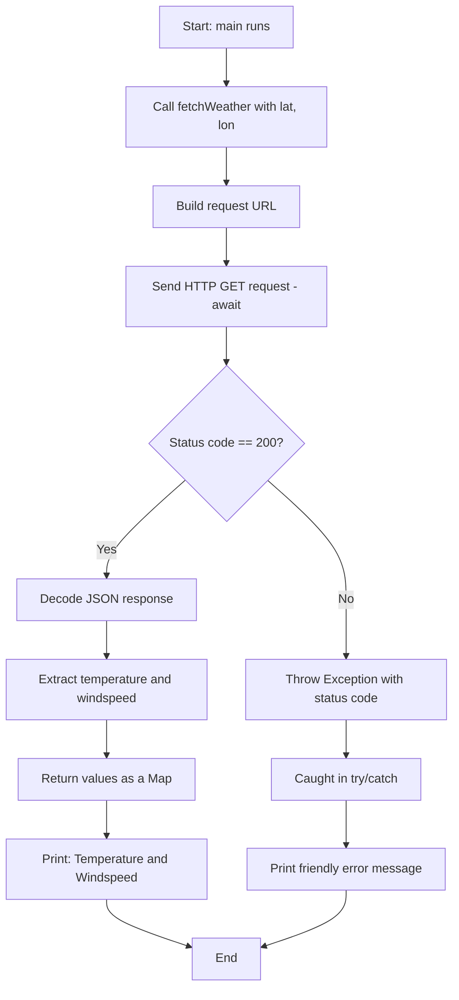

# Weather App (Console) — Real API Practical

A console app that fetches live weather data from the Open-Meteo API
using async/await, HTTP requests, and JSON parsing.

## What this practical covers

- Making a real HTTP GET request (`http` package)
- Parsing JSON response into a Dart `Map`
- `async`/`await` with a real network call (not just `Future.delayed`)
- Error handling for failed/bad requests (`try/catch`)
- Using `pubspec.yaml` to add an external package

## How the code works

1. `fetchWeather(lat, lon)` builds a request URL using the given
   coordinates.
2. It sends an HTTP GET request and waits (`await`) for the response.
3. If the response is successful (status code `200`), it decodes the
   JSON body into a `Map`, pulls out `current_weather`, and extracts
   `temperature` and `windspeed`.
4. If the request fails (bad status code), it throws an exception
   instead of returning bad data.
5. `main()` calls `fetchWeather()` inside a `try/catch`, so a failed
   request (no internet, bad response, etc.) doesn't crash the whole
   app — it prints a friendly error instead.

## Flowchart



## How to run it

1. **Create a Dart project** (if not already done):

   ```bash
   dart create weather_app
   cd weather_app
   ```

2. **Add the `http` package** — open `pubspec.yaml`, add under
   `dependencies:` (2-space indent, must be nested):

   ```yaml
   dependencies:
     http: ^1.2.0
   ```

3. **Install the package:**

```bash
   dart pub get
   ```

1. **Add the code** — paste the code above into your `.dart` file
   (e.g. `main.dart` or `bin/weather_app.dart`).

2. **Run it:**

```bash
   dart run main.dart
```

   (Or, if your file follows Dart's convention at
   `bin/weather_app.dart`, just `dart run` works with no path needed.)

1. **Requires internet access** — this hits a real API endpoint, so it
   won't work offline or in a sandboxed environment with no network.

## Sample output

```plaintext
Temperature: 32.5°C, Windspeed: 12.3 km/h
```

(Values will differ based on real current weather at the given
coordinates.)
